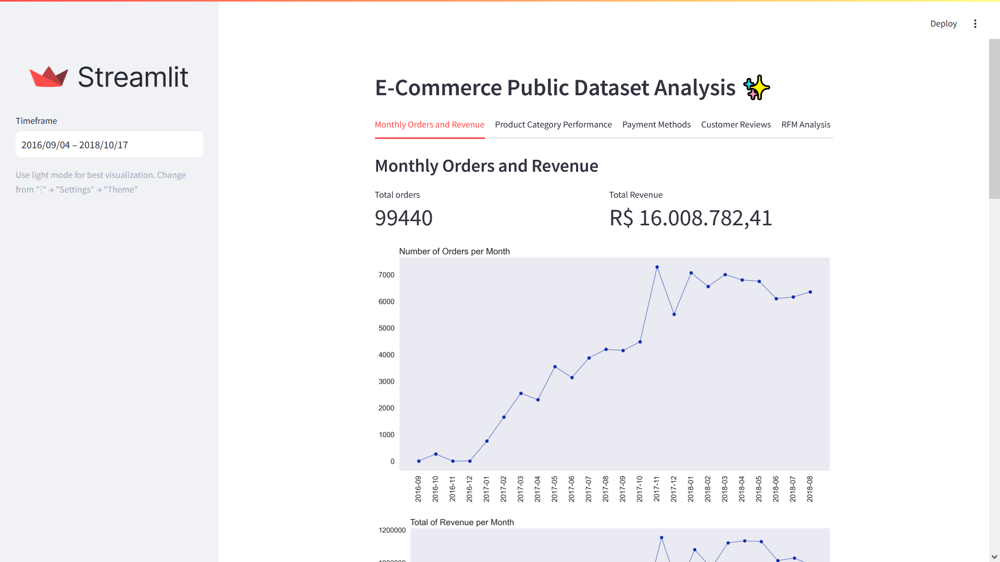
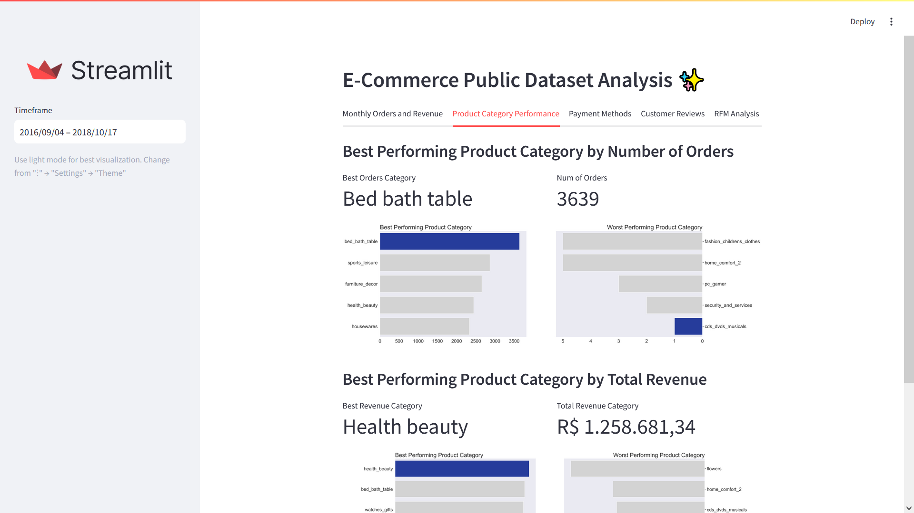
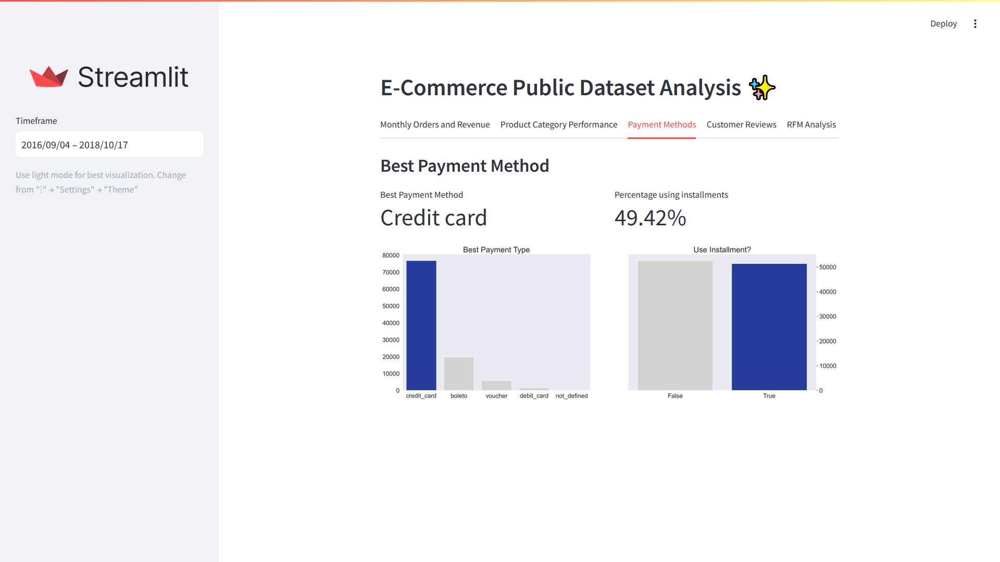
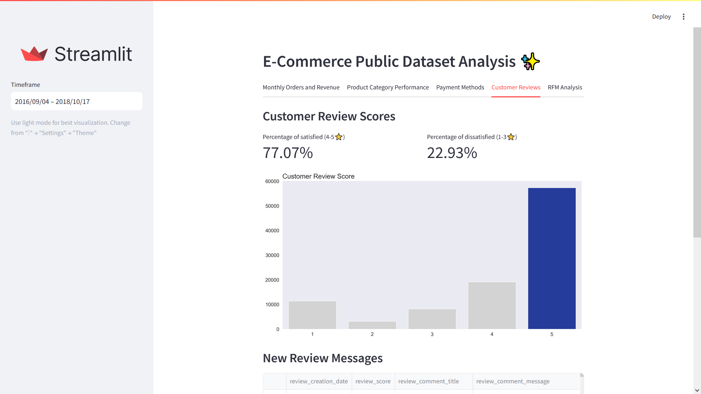
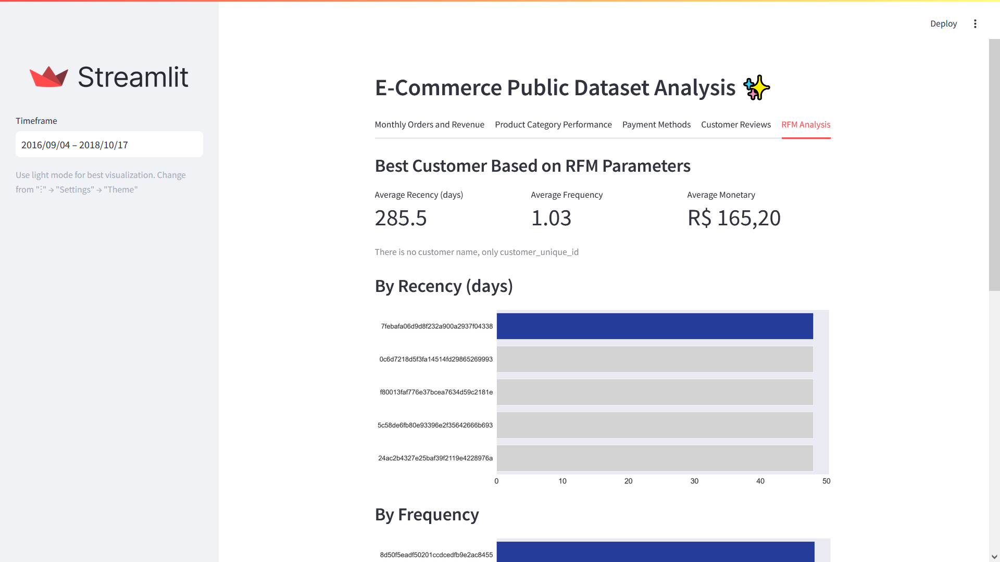

# Proyek Akhir Dicoding: "Belajar Analisis Data dengan Python"
- `Nama`: Bayu Siddhi Mukti

## Deskripsi Proyek

Repository ini merupakan proyek akhir dari kelas Dicoding "Belajar Analisis Data dengan Python". Proyek ini berusaha melakukan analisis terhadap data E-Commerce Public Dataset yang telah disediakan Dicoding atau melalui sumber [Kaggle](https://www.kaggle.com/datasets/olistbr/brazilian-ecommerce) dengan judul **Brazilian E-Commerce Public Dataset by Olist**. Tujuan dari analisis ini adalah untuk mengeksplorasi dan mengenal dataset, serta menemukan beberapa wawasan menarik dari data untuk menjawab pertanyaan bisnis. 

## Struktur Utama Proyek

- `./data`: Berisi seluruh dataset dalam format `.csv` yang digunakan dalam notebook `Proyek_Analisis_Data.ipynb`.
- `./dashboard`: Berisi seluruh file dan kode yang digunakan untuk membangun dashboard hasil analisis data menggunakan Streamlit.
- `Proyek_Analisis_Data.ipynb`: File Interactive Jupyter Notebook (`.ipynb`) tempat dilakukan seluruh proses analisis data.

## Cara Instalasi dan Menjalankan Dashboard
1. Clone repository ke komputer lokal menggunakan perintah berikut.
   ```commandline
   git clone https://github.com/bayu-siddhi/e-commerce-data-analysis.git
   ```

2. Setelah masuk ke dalam root directory (direktori awal) dari proyek ini di komputer lokal Anda, buat virtual environment (contoh dengan nama `.venv`) untuk meng-install seluruh dependency yang dibutuhkan untuk menjalankan notebook dan dashboard.
   ```commandline
   python -m venv .venv
   ```

3. Aktifkan virtual environment `.venv` tersebut dengan menjalankan perintah berikut.
   ```commandline
   .\.venv\Scripts\activate
   ```

4. Setelah virtual environment aktif, maka langkah selanjutnya adalah menginstall dependency proyek ini dengan menjalankan perintah berikut.
   ```commandline
   pip install -r requirements.txt
   ```

5. Setelah seluruh dependency berhasil di-install, maka dashboard dapat dijalankan dengan menggunakan perintah berikut.
   ```commandline
   streamlit run .\dashboard\main.py
   ```

## Cara Alternatif
Jika langkah nomor 4 dan 5 tidak berhasil dilakukan maka gunakan cara manual untuk memanggil virtual environment menggunakan cara berikut.
> Pastikan posisi current working directory berada di root (awal) direktori proyek.

4. Alternatif langkah nomor 4.
   ```commandline
   .\.venv\Scripts\python.exe -m pip install -r requirements.txt
   ```

5. Alternatif langkah nomor 5.
   ```commandline
   .\.venv\Scripts\python.exe -m streamlit run .\dashboard\main.py
   ```

## Screenshots

Berikut ini merupakan beberapa screenshot dashboard yang berhasil dijalankan.






